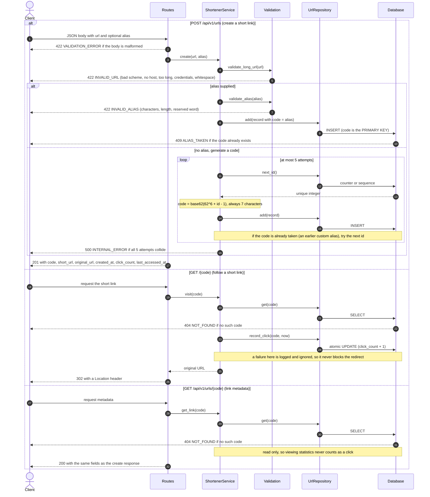
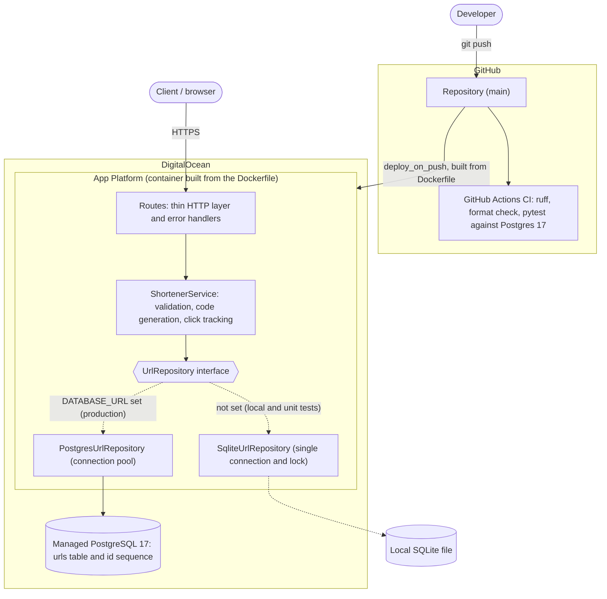

# Architecture

Two views of the system: how a request flows through the code (Diagram 1), and how the pieces are
organised and deployed (Diagram 2). The decisions behind them, with the alternatives that were
rejected, are in [Design decisions](#design-decisions).

## Diagram 1: request lifecycle

One diagram covering all three endpoints. Read each block top to bottom. Every failure path is
labelled with the HTTP status and error code the client receives; all errors share the envelope
`{"error": {"code": "...", "message": "..."}}`.

## Diagram 2: components and deployment

Solid arrows are runtime calls. Dotted arrows show which implementation is chosen: the repository is an
interface, and `DATABASE_URL` decides the backend at startup.

The single rule that keeps this maintainable: **dependencies point inward.** Routes know the service,
the service knows only the repository interface, and neither knows which database is behind it.
Adding PostgreSQL required no change to the service, routes, validation or error handlers.

## Layers and responsibilities

| Layer | Module | Responsibility | Knows about |
|---|---|---|---|
| HTTP | `app/api/routes.py`, `app/api/error_handlers.py` | Translate HTTP to service calls, and errors to the JSON envelope | Service, schemas |
| Business rules | `app/service.py`, `app/validation.py`, `app/codegen.py`, `app/base62.py` | Validate input, generate codes, handle collisions, record clicks | Repository interface only |
| Storage | `app/repository.py`, `app/postgres_repository.py` | Persist records, atomic counters and clicks | Database driver |
| Wiring | `app/main.py`, `app/config.py` | Build the object graph, choose the backend, read settings | Everything |

`app/errors.py` holds domain exceptions with no HTTP details. The error handlers are the only place
that maps them to status codes.

## Design decisions

Each row is a decision that was made deliberately, with the alternatives that were considered.

| Topic | Decision | Alternatives considered | Why |
|---|---|---|---|
| Short-code generation | Base62 of a unique counter, starting at 62^6 so every code is 7 characters | Random characters with retry; a hash of the URL | A counter cannot collide with other generated codes and needs no retry logic in the common case. A hash contradicts "one code per link" and can collide unrecoverably. **Trade-off:** codes are sequential and therefore guessable |
| One code per link | No deduplication: shortening the same URL twice gives two codes | Return the existing code | Each link keeps its own click statistics |
| Custom alias vs generated code | Both live in the same namespace. The database `PRIMARY KEY` decides races, and the generator skips codes already claimed as aliases | Separate namespaces; check then insert | No check-then-insert race, and no gaps caused by aliases (aliases do not consume counter values) |
| Alias rules | ASCII letters and digits, 3 to 32 characters, case-sensitive, not trimmed, reserved words rejected case-insensitively | Allow `-` and `_`; case-insensitive matching | Same alphabet as generated codes. A test discovers the app's real root-level routes so the reserved list cannot silently drift |
| URL validation | `http` or `https` only, host required, at most 2048 characters, no whitespace or control characters, no embedded credentials. Stored as sent (trimmed) | Pydantic `HttpUrl`; reachability checks; SSRF filtering | A pure function is framework-independent and easy to test. `HttpUrl` silently rewrites URLs. Reachability checks are slow and unnecessary because the server never fetches the URL |
| Redirect status | 302 | 301; 307 | A 301 is cached by browsers, so repeat visits would never reach the server and clicks would be undercounted |
| Click tracking | Recorded inline in one atomic `UPDATE`. A failure is logged and never blocks the redirect | Background task; message queue | Simple and testable. Analytics matter less than the visitor reaching their destination. A queue is the answer to "how would you scale this?" |
| Metadata | Create and metadata return one shared response shape. Reading metadata never counts as a click | Separate response models | One schema and one code path cannot drift apart |
| Errors | One envelope `{"error": {"code", "message"}}` for every failure, including framework 404 and 405. 422 for invalid input, 409 for a taken alias | FastAPI's default bodies; RFC 9457 | Clients handle a single shape and branch on a stable machine-readable code |
| Storage | A repository interface with SQLite and PostgreSQL implementations, chosen by `DATABASE_URL` | SQLite only; an ORM | SQLite gives a fast, dependency-free local loop. PostgreSQL gives persistence in production. SQLite on App Platform loses its data on every redeploy |
| Postgres access | `psycopg` with plain SQL and a connection pool; a native sequence for ids; UTC normalisation when reading | SQLAlchemy; asyncpg | Four short statements do not justify an ORM. The service is synchronous by design |
| Deployment | App Platform built from the Dockerfile, with a managed dev database, described in `.do/app.yaml` | A Droplet with a volume; console clicks | Reproducible infrastructure as code, managed HTTPS |

### Scaling notes (what would change next)

- **More traffic:** run more instances. They share one database and one sequence, so nothing else changes.
- **Click volume:** move click recording to a queue and aggregate in batches instead of one write per redirect.
- **Read-heavy redirects:** add a cache in front of `get`, and accept that the click count then needs a separate write path.
- **Guessable codes:** if enumeration matters, permute or obfuscate the counter value before encoding.
- **Schema changes:** adopt a migration tool. Tables are currently created at startup with `IF NOT EXISTS`.
